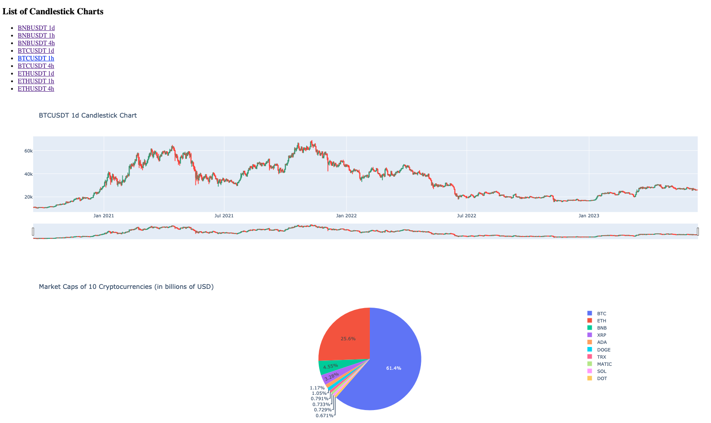

## Task description

### Task 1
Write a script to collect data from Binance API for provided interval (can be 1d, 4h, 1h) and for provided symbol (BTCUSDT, ETHUSDT, etc.).
Suggest a method of deploying such a script to collect relevant data in the interval of your choice (every 1D, 4H, 1H).
Save data in csv format.
Suggest format of saving data in a relational database.

### Task 2
Write a simple Flask UI, which will display a page with candlestick data from task 1, using plotly as a module for output (since it works dynamically using js), and a piechart of market caps for 10 symbols of your choice.

## Deployment
To run both scripts, you need to have Docker and Docker Compose installed on your machine. You can check if you have them installed by running the following commands:
```bash
docker -v
docker-compose -v
```
If you don't have them installed, please follow the instructions on the official Docker website: https://docs.docker.com/get-docker/

To run the solution, please follow the steps below:
1. Clone the repository to your machine:
```bash
git clone https://github.com/LexGlu/binance-api.git
```
2. Go to the project directory:
```bash
cd binance-api
```
3. Run the following command:
```bash
docker-compose up -d
```
4. Wait for the containers to be built and started. Please not that Python script [get_kline_data.py](./get_kline_data.py) will run on startup (to collect sample data from Binance API). You can check the status of the containers with the following command:
```bash
docker-compose ps
```
5. When the containers are up and running, you can check Flask UI, which will display a page with candlesticks data and a piechart of market caps for 10 tokens. It is available at http://localhost:5555.

6. You can check the data in the database using GUI for the database. It is available at http://localhost:8080. You can use credentials from the file [.env](./.env) to login to the database and check the data.

7. To stop the containers, run the following command:
```bash
docker-compose down -v # -v flag is used to remove volumes as well (database data)
```

## Solution description
### Task 1
The script [get_kline_data.py](./get_kline_data.py) uses Binance API endpoint (https://api.binance.com/api/v3/klines) to collect data for provided interval and symbol. It saves the data in csv format and also saves it in the database (PostgreSQL). The database credentials are stored in the [.env](./.env) file and it runs in a separate container (see [docker-compose.yml](./docker-compose.yml)).

The script will run every hour using cron job. The cron job is defined in the [crontab](./crontab) file.

Detailed logs are stored in the [logs.txt](./logs.txt) file. Also logs of cron jobs are stored in the [cron.log](./cron.log) file.

The database schema is as follows:
- 'open_time' - timestamp of the start of the candlestick (timestamp)
- 'open_price' - price at the start of the candlestick (float)
- 'high_price' - highest price during the candlestick (float)
- 'low_price' - lowest price during the candlestick (float)
- 'close_price' - price at the end of the candlestick (float)
- 'volume' - volume during the candlestick (float)
- 'close_time' - timestamp of the end of the candlestick (timestamp)
- 'quote_asset_volume' - volume of the quote asset during the candlestick (float)
- 'number_of_trades' - number of trades during the candlestick (int)
- 'taker_buy_base_asset_volume' - volume of the base asset bought by taker during the candlestick (float)
- 'taker_buy_quote_asset_volume' - volume of the quote asset bought by taker during the candlestick (float)

### Task 2
The Flask UI is implemented in [app.py](./app.py). It uses the data from the database to display candlesticks and piechart. The candlesticks and piechart are implemented using plotly library. The UI is available at http://localhost:5555 (several charts are available, you can switch between them using the list in the top left corner).

